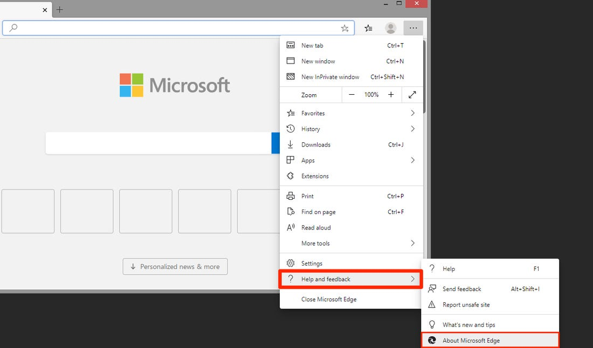

# Playstation5AutoBuyer
A python notify / auto-buy application for the scarce Playstation 5 (Netherlands only).  

Feel free to contact me on [twitter](https://twitter.com/dejongolle) if you have any questions. 

## Get started

If you want to use the SMS notify feature, make sure you have a [callr](https://www.callr.com/) account with credit on it.  

1) Install python, and make sure you check the box which says: "Add Python VERSION to PATH".  
  

2) Install python packages via PIP. Required python packages:
    - configparser
    - callr
    - notify-py
    - msedge-selenium-tools

Example:  
```
pip install callr
```

3) Make sure you have Microsoft Edge installed. Then; check what version of Edge you have got installed on your system. Like so:  

  

Memorize the version number, and download the MicroSoft Edge WebDriver with the same version number [here](https://developer.microsoft.com/en-us/microsoft-edge/tools/webdriver/).
Go ahead and store the driver executable anywhere you like and copy its absolute path. Now, in StockNotifierPS5.py, in the function delegate_buy_item(),
paste your path inside the quotation marks (").

4) After that is done. Fill out the rest of your personal details in the config file.   
   You can also change the settings to your liking. 

### DONE

## Running the script

In a CommandPrompt window, navigate to the StockNotifier folder like so:  
```
cd C:\Users\YourPcName\Location\Of\StockNotifier
```

Once in the StockNotifier folder, run the script like so:
```
python StockNotifierPS5.py
```
or  
```
python3 StockNotifierPS5.py
```
