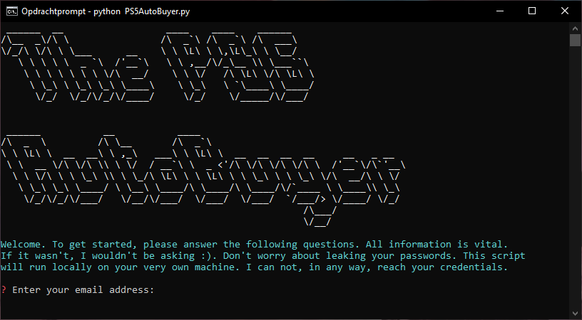
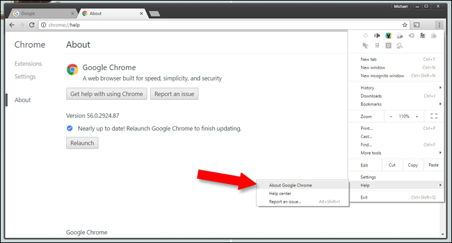
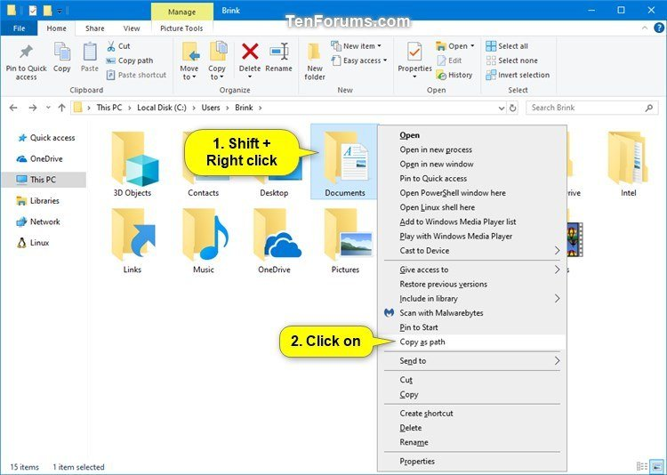

# Playstation 5 AutoBuyer | The Netherlands only



*Please note; usage of tools like this to gain an advantage over other customers is not ethically right.*

**Auto-buy works for Coolblue, BOL.COM, Mediamarkt and Nedgame.**

This script's aim is to auto-buy Playstation 5 consoles. At first, this little fun project was meant to be designed only for notifying users when a Playstation 5 might be in stock. However, the more time I put in this, the more I wanted to expand it.
The script is designed only to work for pre-determined web-stores within the Netherlands.

Furthermore, feel free to contact me on [twitter](https://twitter.com/dejongolle) if you have any questions.

## Get started

### Installation

1) Install [python](https://www.python.org/downloads/), and make sure you check the box which says: "Add Python VERSION to PATH".  
  

2) Using a command prompt, install the python packages via pip:
```
pip install -r requirements.txt
```
or
```
pip3 install -r requirements.txt
```

3) Download the Chrome WebDriver

Make sure you have Chrome installed. Then; check what version of Chrome you have got installed on your system. Like so:  

  

Memorize the version number, and download the Chrome WebDriver with the same version number [here](https://chromedriver.chromium.org/downloads).   
Go ahead and store the driver executable anywhere you like and copy its full/absolute path. Like so:  

  

Now, in the config.ini file, paste your copied path behind the path_to_driver variable name.   
**Be aware**. Remove the quotation marks. Windows paths should have double backslashes and MacOS paths should have single forward slashes.

## Usage
Once the steps stated above have been completed, you can proceed to run the application.  
### Running the script

In a command prompt / cmd window, navigate to the Playstation5AutoBuyer folder and run the script like so:

```
python PS5AutoBuyer.py
```
or  
```
python3 PS5AutoBuyer.py
```

### Configuring the settings
Answer the questions to setup the application. The different settings are explained below.

#### NATIVELY NOTIFY
Windows as well as MacOS both have a way of natively notifying the user when there is important information the be known.
To be natively notified when a PS5 is in stock, or when a PS5 is ordered, turn this feature on.

#### SMS NOTIFY
This might come in handy when you're not at home, you have auto-buy enabled, but the purchase somehow fails.   
If you would like to be notified via text/SMS when a PS5 is in stock or when a PS5 is ordered, turn this feature on.  
Furthermore, if you want to use the SMS notify feature, make sure you have a [callr](https://www.callr.com/) account with credit on it.   
Fill out your credentials when you're asked for it. 

#### AUTO-BUY
Webshop       | Method of payment
------------- | -------------
Amazon        | Your account must have a creditcard configured
Coolblue      | Bank Transfer
BOL.COM       | Afterpay (availability depends on account)
Mediamarkt    | Paypal  
Nedgame       | Afterpay (phone number needed)
Gamemania     | *To be implemented* 
Intertoys     | *To be implemented*  


This feature allows for automatic purchase of the items. To be able to make the automatic purchase of items successful, 
you will need to have an account at each of the webshops. For the purchase at some locations, you will need to have a paypal account. 
To make use of this feature, please answer the questions. **Be aware of typos**.

#### MAX AMOUNT OF ORDERED ITEMS
Clearly, for most of you reading this, you do not want to spend your entire bank account on only Playstation 5 consoles. 
Because of that, there is a setting through which you can tell the program how many consoles it is allowed to purchase.

<a href="https://www.buymeacoffee.com/olledejong"></a>
